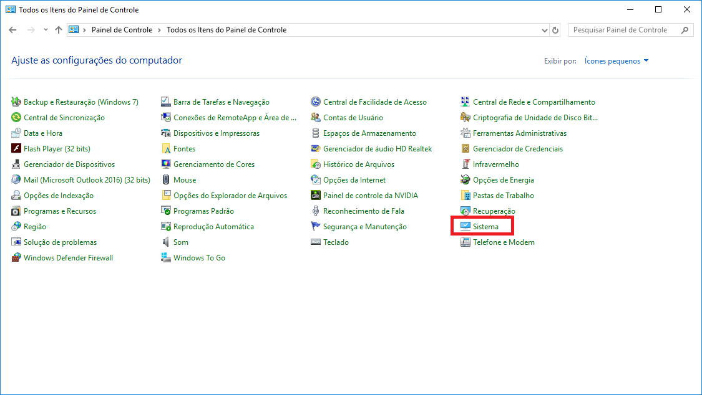
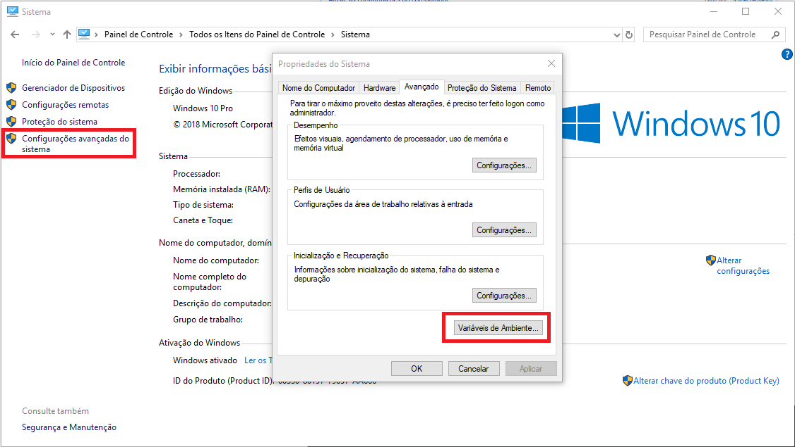

# Como usar o PHP Code Sniffer

 - ## Baixando o PHP

    1. Acesse o [site](https://windows.php.net/download) de download do php e baixe o **Zip** de qualquer versção >= 5.6
    1. Extraia o arquivo em qualquer pasta do sistema
        1. Exemplo: 

- ## Adicionando o PHP nas variáveis de ambiente

    + ## Windows 7
    
        Para adicionar o php nas variáveis de ambiente, clique com o botão direito em **Meu Computador** em seguida, clique em **Propriedades**:
         
       
        Clique em **Configurações avançadas do sistema**, em seguida clique em **Variáveis de Ambiente**:
         

        Procure pela variável **PATH** na tabela superior e clique em **Editar...**:
         

        Ao final do campo **Valor da variável**, adicione um **;** e o caminho completo para a pasta que foi extraído o php:
         

        Após isso, Clique em **OK** para confirmar todas as alterações.
          Para confirmar que o PHP foi instalado com sucesso, abra o console e escreva **php -v** e deverá aparecer a sua versão do php instalada:
         

    + ## Windows 10

        Para adicionar o php nas variáveis de ambiente, abra o **Painel de Controle** e clique em **Sistema**:
         

        Clique em **Configurações avançadas do sistema**, em seguida, clique em **Variáveis de Ambiente**:
         

        No primeiro quadro, selecione **PATH** e clique em **Editar...**:
         

        Clique em **Novo** e escreva o caminho onde o PHP foi extraído:
         

        Após isso, Clique em **OK** para confirmar todas as alterações.
          Para confirmar que o PHP foi instalado com sucesso, abra o console e escreva **php -v** e deverá aparecer a sua versão do php instalada:
         

- ## Baixando o PHP Code Sniffer

    Add some text here

- ## Gerando relatório de erros

    Gerar o relatório de erros é simples a base para o comando será sempre:

        php caminho\para\phpcs.phar caminho\para\pasta\ou\arquivo
    
    Porém nosso intuito é garantir style code, mas qual é o padrão? **PSR2**! 
    sendo assim, nosso comando agora ficará:

        php caminho\para\phpcs.phar --standard=psr2 caminho\para\pasta\ou\arquivo

    Para listar a quantidade de erros por arquivo, podemos definir o parâmetro **report=summary**, com ele também podemos saber quantos erros o comando **PHPCBF** consegue corrigir.

        ## Exemplo de comando
        php caminho\para\phpcs.phar --standard=psr2 --report=summary caminho\para\pasta\ou\arquivo
    
    Para listar a quantidade de erros por definição de erro, podemos definir o parâmetro **report=source**, com ele também podemos saber quantos arquivos serão afetados pelo comando **PHPCBF**.

        ## Exemplo de comando
        php caminho\para\phpcs.phar --standard=psr2 --report=source caminho\para\pasta\ou\arquivo

- ## Executando correção automática de erros

    Add some text here